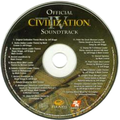

# Civ IV Music for Unciv

Provides some of IV's music in [Unciv](https://github.com/yairm210/Unciv).

## See Also

- [Civ IV Sounds](https://github.com/robloach/civ-iv-sounds)

## Installation

1. Open Unciv
2. Open the Mods menu
3. Click Sort and Filter
4. Search for "Civ IV Music"
5. Download and install
6. Enable "Permanent audiovisual mod"
